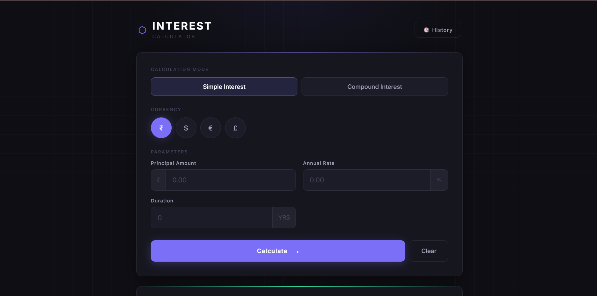
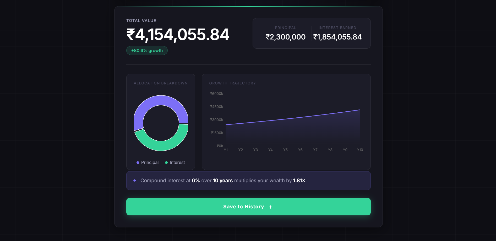
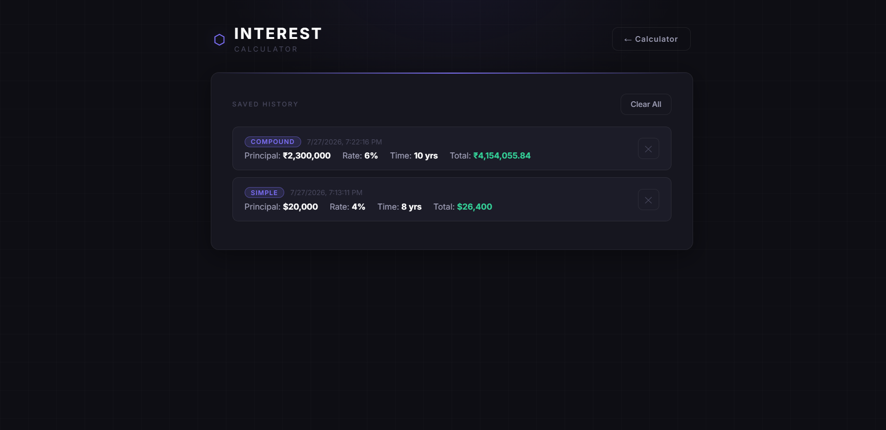

# 📈 Interest Calculator

A modern, responsive **Interest Calculator** built with **React** and **Vite** that helps users calculate **Simple Interest** and **Compound Interest** with interactive visualizations. The application features a clean dark-themed interface, multiple currency support, graphical insights, and a persistent calculation history for an enhanced user experience.

---

## ✨ Features

- 💰 Calculate **Simple Interest** and **Compound Interest**
- 🌍 Multi-currency support (**₹ INR**, **$ USD**, **€ EUR**, **£ GBP**)
- 📊 Interactive charts to visualize investment growth
- 🥧 Donut chart showing **Principal vs Interest Earned**
- 📈 Growth trajectory chart displaying wealth over time
- 📌 Displays key investment metrics such as:
  - Total Amount
  - Interest Earned
  - Growth Percentage
  - Wealth Multiplier
- 🕒 Save and manage calculation history
- 🌙 Modern, responsive dark-themed user interface
- ⚡ Fast performance powered by **Vite**

---

## 🛠️ Tech Stack

- **Frontend:** React.js
- **Build Tool:** Vite
- **State Management:** React Context API
- **Styling:** CSS3
- **JavaScript:** ES6+
- **Linting:** ESLint

---

## 📁 Project Structure

```text
INTEREST-CALCULATOR/
├── screenshots/
│   ├── graph.png
│   ├── history.png
│   └── homepage.png
├── src/
│   ├── assets/
│   │   └── react.svg
│   ├── Components/
│   │   ├── AdvancedCalculator.jsx
│   │   ├── Charts.jsx
│   │   ├── Header.jsx
│   │   ├── HistoryPanel.jsx
│   │   ├── InterestForm.jsx
│   │   └── ResultCard.jsx
│   ├── context/
│   │   └── HistoryContext.jsx
│   ├── utils/
│   │   └── calculate.js
│   ├── App.css
│   ├── App.jsx
│   ├── index.css
│   └── main.jsx
├── eslint.config.js
├── index.html
├── package.json
├── vite.config.js
└── README.md
```

---

## 📸 Screenshots

### 🏠 Home Page



---

### 📊 Investment Growth Chart



---

### 🕒 Calculation History



---

## 🚀 Getting Started

### Prerequisites

Make sure you have the following installed:

- Node.js (v16 or later)
- npm

### Installation

Clone the repository:

```bash
git clone https://github.com/pavanijillella-source/interest-calculator.git
```

Navigate to the project directory:

```bash
cd interest-calculator
```

Install dependencies:

```bash
npm install
```

Run the development server:

```bash
npm run dev
```

Build for production:

```bash
npm run build
```

---

## 📝 Usage

1. Choose **Simple Interest** or **Compound Interest**.
2. Select your preferred currency.
3. Enter:
   - Principal Amount
   - Interest Rate
   - Time (Years)
4. Click **Calculate**.
5. View:
   - Total Amount
   - Interest Earned
   - Growth Percentage
   - Wealth Multiplier
   - Investment Charts
6. Save your calculation to the history panel for future reference.

---

## 🚀 Future Enhancements

- Export calculation history
- Inflation-adjusted return calculator
- User authentication
- Cloud synchronization

---

## 👩‍💻 Author

**Pavani Jillella**

- GitHub: https://github.com/pavanijillella-source
- LinkedIn: https://www.linkedin.com/in/pavani-jillella

---

## ⭐ Support

If you found this project useful, consider giving it a **⭐ Star** on GitHub!

---

## 📄 License

This project is licensed under the **MIT License**.